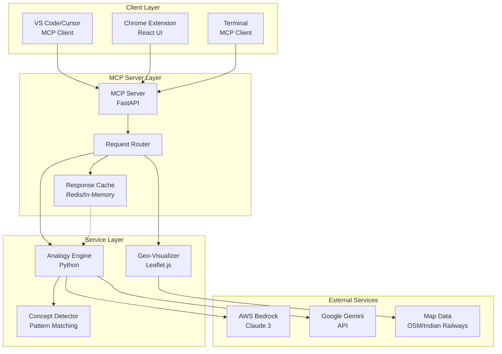
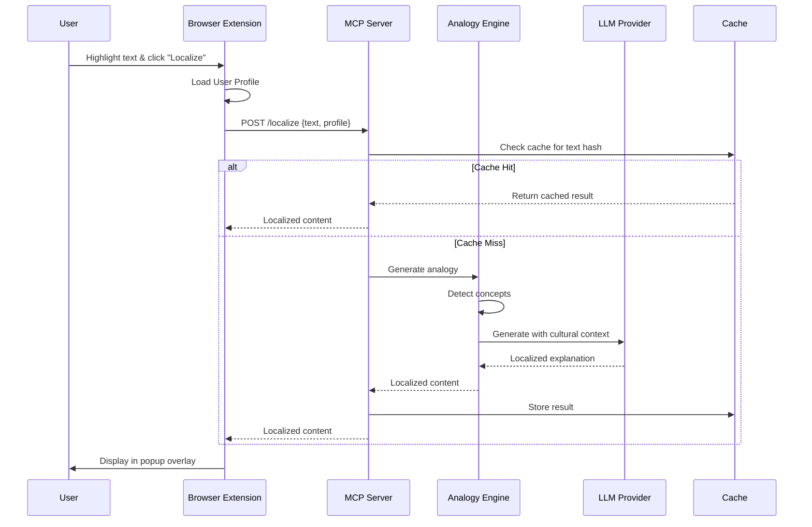

# Design Document: Code-Katha (The Concept Localizer)

## Overview

Code-Katha is a distributed system that localizes technical programming concepts for Indian students through culturally relevant analogies. The architecture consists of four main components:

1. **MCP Server** (Python/FastAPI): Core backend service exposing localization capabilities via Model Context Protocol
2. **Analogy Engine** (Python): AI-powered service using LLMs (AWS Bedrock Claude 3 or Google Gemini) to generate cultural analogies
3. **Browser Extension** (React/TypeScript): Chrome extension for on-demand webpage localization
4. **Geo-Visualizer** (JavaScript/Leaflet.js): Interactive map component for visualizing graph algorithms on Indian geography

The system follows a client-server architecture where multiple clients (IDE extensions, browser extension, terminal) communicate with the MCP server, which orchestrates the analogy generation and visualization services.

### Key Design Principles

- **Cultural Authenticity**: Analogies must be genuinely relatable to Indian students, not stereotypical
- **Technical Accuracy**: Localization adapts context, not correctness
- **Performance**: Sub-5-second response times for typical use cases
- **Extensibility**: Easy to add new cultural metaphor categories and LLM providers
- **Privacy**: User profiles and preferences stored locally, not transmitted unnecessarily

## Architecture

### System Architecture Diagram



### Component Interaction Flow



## Components and Interfaces

### 1. MCP Server (FastAPI)

The MCP Server is the central orchestration layer implementing the Model Context Protocol specification.

#### Responsibilities
- Expose MCP-compliant endpoints for IDE and terminal clients
- Handle HTTP requests from browser extension
- Manage request routing to appropriate services
- Implement caching strategy
- Handle authentication and rate limiting
- Log requests and metrics

#### API Endpoints

**MCP Protocol Endpoints** (for IDE/Terminal clients):
```python
# MCP standard endpoints
POST /mcp/initialize
  Request: {client_info, capabilities}
  Response: {server_info, capabilities}

POST /mcp/tools/call
  Request: {tool_name: "localize", arguments: {text, profile}}
  Response: {result: localized_content}

POST /mcp/tools/list
  Response: {tools: [{name: "localize", description, parameters}]}
```

**HTTP REST Endpoints** (for Browser Extension):
```python
POST /api/v1/localize
  Request: {
    text: string,
    profile: {
      categories: string[],  # ["cricket", "bollywood", ...]
      language: string       # "en" or "hi"
    }
  }
  Response: {
    original: string,
    localized: string,
    concepts_detected: string[],
    metaphors_used: string[],
    cached: boolean
  }

POST /api/v1/visualize
  Request: {
    algorithm: string,      # "dijkstra", "bfs", "dfs", "mst"
    graph_data: object,
    map_region: string      # "mumbai_local", "delhi_metro", "highways"
  }
  Response: {
    visualization_url: string,
    map_data: object,
    animation_steps: array
  }

GET /api/v1/profile
  Response: {profile_schema}

PUT /api/v1/profile
  Request: {profile_data}
  Response: {success: boolean}
```

#### Configuration
```python
class MCPServerConfig:
    host: str = "localhost"
    port: int = 8000
    llm_provider: str = "bedrock"  # or "gemini"
    cache_ttl: int = 86400  # 24 hours
    rate_limit: int = 100  # requests per minute
    max_text_length: int = 5000  # characters
    timeout: int = 30  # seconds
```

### 2. Analogy Engine

The Analogy Engine is responsible for concept detection and culturally-aware content generation.

#### Responsibilities
- Detect technical concepts in input text
- Generate culturally relevant analogies using LLMs
- Maintain technical accuracy while adapting context
- Handle multiple cultural metaphor categories
- Implement fallback strategies for generation failures

#### Core Classes

```python
class AnalogyEngine:
    """Main engine for generating culturally localized analogies."""
    
    def __init__(self, llm_provider: LLMProvider, concept_detector: ConceptDetector):
        self.llm_provider = llm_provider
        self.concept_detector = concept_detector
        self.prompt_templates = PromptTemplateLibrary()
    
    def localize(self, text: str, profile: UserProfile) -> LocalizedContent:
        """
        Main entry point for localization.
        
        Args:
            text: Original technical text
            profile: User's cultural preferences
            
        Returns:
            LocalizedContent with original and localized versions
        """
        pass
    
    def detect_concepts(self, text: str) -> List[Concept]:
        """Identify technical concepts in text."""
        pass
    
    def generate_analogy(self, concept: Concept, profile: UserProfile) -> str:
        """Generate culturally relevant analogy for a concept."""
        pass


class ConceptDetector:
    """Detects programming concepts in text using pattern matching and NLP."""
    
    # Concept patterns (regex + keyword matching)
    CONCEPT_PATTERNS = {
        "class": r"\b(class|object|instance|inheritance|polymorphism)\b",
        "function": r"\b(function|method|procedure|subroutine|lambda)\b",
        "recursion": r"\b(recursion|recursive|base case|recursive call)\b",
        "data_structure": r"\b(array|list|stack|queue|tree|graph|hash)\b",
        "algorithm": r"\b(algorithm|sort|search|traverse|dijkstra|bfs|dfs)\b",
        "async": r"\b(async|await|promise|callback|concurrent)\b",
    }
    
    def detect(self, text: str) -> List[Concept]:
        """
        Detect concepts using pattern matching.
        
        Returns list of detected concepts with confidence scores.
        """
        pass


class PromptTemplateLibrary:
    """Manages prompt templates for different concepts and cultural contexts."""
    
    def get_template(self, concept: str, cultural_category: str) -> str:
        """
        Retrieve prompt template for concept and cultural context.
        
        Example template for "class" + "cricket":
        '''
        You are an expert educator explaining programming to Indian students.
        
        Original concept: {concept_text}
        
        Rewrite this explanation using a Cricket analogy. For example:
        - A class is like a cricket team template
        - Objects are individual teams (MI, CSK, RCB)
        - Methods are team actions (bat, bowl, field)
        - Attributes are team properties (players, coach, home ground)
        
        Maintain technical accuracy. Only change examples and metaphors.
        Keep all code snippets unchanged.
        '''
        """
        pass


class LLMProvider(ABC):
    """Abstract base class for LLM providers."""
    
    @abstractmethod
    def generate(self, prompt: str, max_tokens: int = 1000) -> str:
        """Generate text using the LLM."""
        pass


class BedrockProvider(LLMProvider):
    """AWS Bedrock implementation using Claude 3."""
    
    def __init__(self, region: str = "us-east-1", model_id: str = "anthropic.claude-3-sonnet-20240229-v1:0"):
        self.client = boto3.client("bedrock-runtime", region_name=region)
        self.model_id = model_id
    
    def generate(self, prompt: str, max_tokens: int = 1000) -> str:
        """Call Bedrock API with Claude 3."""
        request_body = {
            "anthropic_version": "bedrock-2023-05-31",
            "max_tokens": max_tokens,
            "messages": [{"role": "user", "content": prompt}]
        }
        response = self.client.invoke_model(
            modelId=self.model_id,
            body=json.dumps(request_body)
        )
        return json.loads(response["body"].read())["content"][0]["text"]


class GeminiProvider(LLMProvider):
    """Google Gemini implementation."""
    
    def __init__(self, api_key: str, model: str = "gemini-pro"):
        genai.configure(api_key=api_key)
        self.model = genai.GenerativeModel(model)
    
    def generate(self, prompt: str, max_tokens: int = 1000) -> str:
        """Call Gemini API."""
        response = self.model.generate_content(
            prompt,
            generation_config={"max_output_tokens": max_tokens}
        )
        return response.text
```

#### Prompt Engineering Strategy

The quality of localization depends heavily on prompt design. Key strategies:

1. **Few-Shot Learning**: Include 2-3 examples of good localizations in the prompt
2. **Constraint Specification**: Explicitly state what to preserve (code, terminology) and what to adapt (examples, metaphors)
3. **Cultural Context**: Provide specific cultural references relevant to the user's profile
4. **Validation Instructions**: Ask the LLM to verify technical accuracy before responding

Example prompt structure:
```
System: You are an expert educator specializing in making programming concepts accessible to Indian students.

Context: The user is interested in {cultural_categories}.

Task: Rewrite the following technical explanation using {cultural_metaphor} analogies.

Constraints:
- Preserve all technical terminology
- Keep code snippets unchanged
- Only adapt examples and metaphors
- Maintain technical accuracy
- Use culturally authentic references (not stereotypes)

Examples:
[2-3 high-quality examples]

Input:
{original_text}

Output:
```

### 3. Browser Extension (React/TypeScript)

The browser extension provides on-demand localization for web content.

#### Architecture

```
browser-extension/
├── manifest.json          # Chrome extension manifest
├── src/
│   ├── background/
│   │   └── service-worker.ts    # Background service worker
│   ├── content/
│   │   └── content-script.ts    # Injected into web pages
│   ├── popup/
│   │   ├── Popup.tsx            # Extension popup UI
│   │   └── LocalizationPanel.tsx
│   ├── components/
│   │   ├── ProfileSelector.tsx
│   │   └── LocalizedView.tsx
│   ├── services/
│   │   ├── api-client.ts        # MCP server communication
│   │   └── storage.ts           # Chrome storage API wrapper
│   └── types/
│       └── index.ts
└── public/
    └── icons/
```

#### Key Components

```typescript
// Content Script - Injected into web pages
class ContentScript {
  private selectionHandler: SelectionHandler;
  private overlayRenderer: OverlayRenderer;
  
  constructor() {
    this.selectionHandler = new SelectionHandler();
    this.overlayRenderer = new OverlayRenderer();
    this.initializeListeners();
  }
  
  private initializeListeners(): void {
    // Listen for text selection
    document.addEventListener('mouseup', this.handleSelection.bind(this));
    
    // Listen for messages from popup/background
    chrome.runtime.onMessage.addListener(this.handleMessage.bind(this));
  }
  
  private async handleSelection(event: MouseEvent): Promise<void> {
    const selectedText = window.getSelection()?.toString().trim();
    
    if (selectedText && selectedText.length > 10) {
      // Show "Localize" button near selection
      this.overlayRenderer.showLocalizeButton(event.clientX, event.clientY);
    }
  }
  
  private async localizeSelection(text: string): Promise<void> {
    // Send to background script for API call
    const response = await chrome.runtime.sendMessage({
      action: 'localize',
      text: text
    });
    
    // Display result in overlay
    this.overlayRenderer.showLocalizedContent(response);
  }
}

// Background Service Worker
class BackgroundService {
  private apiClient: MCPApiClient;
  private cache: LocalCache;
  
  constructor() {
    this.apiClient = new MCPApiClient('http://localhost:8000');
    this.cache = new LocalCache();
    this.initializeListeners();
  }
  
  private initializeListeners(): void {
    chrome.runtime.onMessage.addListener(this.handleMessage.bind(this));
  }
  
  private async handleMessage(
    message: any,
    sender: chrome.runtime.MessageSender,
    sendResponse: (response: any) => void
  ): Promise<void> {
    if (message.action === 'localize') {
      const profile = await this.loadProfile();
      const result = await this.localizeText(message.text, profile);
      sendResponse(result);
    }
  }
  
  private async localizeText(text: string, profile: UserProfile): Promise<LocalizedContent> {
    // Check cache first
    const cacheKey = this.cache.generateKey(text, profile);
    const cached = await this.cache.get(cacheKey);
    
    if (cached) {
      return { ...cached, cached: true };
    }
    
    // Call MCP server
    try {
      const result = await this.apiClient.localize(text, profile);
      await this.cache.set(cacheKey, result);
      return result;
    } catch (error) {
      return {
        original: text,
        localized: text,
        error: error.message
      };
    }
  }
}

// API Client
class MCPApiClient {
  constructor(private baseUrl: string) {}
  
  async localize(text: string, profile: UserProfile): Promise<LocalizedContent> {
    const response = await fetch(`${this.baseUrl}/api/v1/localize`, {
      method: 'POST',
      headers: { 'Content-Type': 'application/json' },
      body: JSON.stringify({ text, profile })
    });
    
    if (!response.ok) {
      throw new Error(`API error: ${response.status}`);
    }
    
    return response.json();
  }
}
```

#### UI Components (React)

```typescript
// Popup UI - Main extension popup
const Popup: React.FC = () => {
  const [profile, setProfile] = useState<UserProfile | null>(null);
  const [isConfigured, setIsConfigured] = useState(false);
  
  useEffect(() => {
    loadProfile();
  }, []);
  
  const loadProfile = async () => {
    const stored = await chrome.storage.local.get('userProfile');
    if (stored.userProfile) {
      setProfile(stored.userProfile);
      setIsConfigured(true);
    }
  };
  
  if (!isConfigured) {
    return <ProfileSetup onComplete={loadProfile} />;
  }
  
  return (
    <div className="popup-container">
      <h2>Code-Katha</h2>
      <ProfileDisplay profile={profile} />
      <button onClick={() => setIsConfigured(false)}>
        Edit Profile
      </button>
      <Instructions />
    </div>
  );
};

// Profile Setup Component
const ProfileSetup: React.FC<{onComplete: () => void}> = ({ onComplete }) => {
  const [selectedCategories, setSelectedCategories] = useState<string[]>([]);
  
  const categories = [
    { id: 'cricket', label: 'Cricket', icon: '🏏' },
    { id: 'bollywood', label: 'Bollywood', icon: '🎬' },
    { id: 'traffic', label: 'Traffic & Transport', icon: '🚗' },
    { id: 'food', label: 'Food & Chai', icon: '☕' },
    { id: 'festivals', label: 'Festivals', icon: '🎉' }
  ];
  
  const handleSave = async () => {
    const profile: UserProfile = {
      categories: selectedCategories,
      language: 'en',
      createdAt: Date.now()
    };
    
    await chrome.storage.local.set({ userProfile: profile });
    onComplete();
  };
  
  return (
    <div className="profile-setup">
      <h3>Choose Your Cultural Preferences</h3>
      <div className="category-grid">
        {categories.map(cat => (
          <CategoryCard
            key={cat.id}
            category={cat}
            selected={selectedCategories.includes(cat.id)}
            onToggle={() => toggleCategory(cat.id)}
          />
        ))}
      </div>
      <button onClick={handleSave} disabled={selectedCategories.length === 0}>
        Save Profile
      </button>
    </div>
  );
};
```

### 4. Geo-Visualizer (Leaflet.js)

The Geo-Visualizer plots graph algorithms on real Indian maps for visual learning.

#### Responsibilities
- Render interactive maps using Leaflet.js
- Load Indian geographic data (train networks, metro systems, highways)
- Animate graph algorithm execution
- Display algorithm metrics and step-by-step progression

#### Implementation

```javascript
class GeoVisualizer {
  constructor(containerId, mapRegion) {
    this.map = L.map(containerId);
    this.mapRegion = mapRegion;
    this.markers = [];
    this.paths = [];
    this.animationQueue = [];
    
    this.initializeMap();
    this.loadRegionData();
  }
  
  initializeMap() {
    // Use OpenStreetMap tiles
    L.tileLayer('https://{s}.tile.openstreetmap.org/{z}/{x}/{y}.png', {
      attribution: '© OpenStreetMap contributors'
    }).addTo(this.map);
  }
  
  async loadRegionData() {
    // Load region-specific data
    const regionData = await this.fetchRegionData(this.mapRegion);
    this.renderRegionGraph(regionData);
  }
  
  async fetchRegionData(region) {
    // Map regions to data sources
    const dataSources = {
      'mumbai_local': '/data/mumbai-local-train.json',
      'delhi_metro': '/data/delhi-metro.json',
      'highways': '/data/indian-highways.json'
    };
    
    const response = await fetch(dataSources[region]);
    return response.json();
  }
  
  renderRegionGraph(data) {
    // Render stations/nodes as markers
    data.nodes.forEach(node => {
      const marker = L.marker([node.lat, node.lng])
        .bindPopup(node.name)
        .addTo(this.map);
      this.markers.push(marker);
    });
    
    // Render connections as polylines
    data.edges.forEach(edge => {
      const path = L.polyline(
        [[edge.from.lat, edge.from.lng], [edge.to.lat, edge.to.lng]],
        { color: 'gray', weight: 2 }
      ).addTo(this.map);
      this.paths.push(path);
    });
    
    // Fit map to show all markers
    const group = L.featureGroup(this.markers);
    this.map.fitBounds(group.getBounds());
  }
  
  visualizeAlgorithm(algorithm, startNode, endNode) {
    // Execute algorithm and collect steps
    const steps = this.executeAlgorithm(algorithm, startNode, endNode);
    
    // Animate steps
    this.animateSteps(steps);
  }
  
  executeAlgorithm(algorithm, start, end) {
    // Implement or call algorithm implementations
    switch(algorithm) {
      case 'dijkstra':
        return this.dijkstra(start, end);
      case 'bfs':
        return this.bfs(start, end);
      case 'dfs':
        return this.dfs(start, end);
      default:
        throw new Error(`Unknown algorithm: ${algorithm}`);
    }
  }
  
  animateSteps(steps) {
    let stepIndex = 0;
    
    const animateNext = () => {
      if (stepIndex >= steps.length) return;
      
      const step = steps[stepIndex];
      
      // Highlight current node
      this.highlightNode(step.node, step.type);
      
      // Draw path if applicable
      if (step.path) {
        this.drawPath(step.path);
      }
      
      // Update metrics display
      this.updateMetrics(step.metrics);
      
      stepIndex++;
      setTimeout(animateNext, 500); // 500ms between steps
    };
    
    animateNext();
  }
  
  highlightNode(nodeId, type) {
    const marker = this.markers[nodeId];
    const colors = {
      'visiting': 'yellow',
      'visited': 'green',
      'path': 'blue',
      'start': 'red',
      'end': 'red'
    };
    
    marker.setIcon(L.divIcon({
      className: 'custom-marker',
      html: `<div style="background-color: ${colors[type]}; width: 20px; height: 20px; border-radius: 50%;"></div>`
    }));
  }
  
  drawPath(pathNodes) {
    const coordinates = pathNodes.map(nodeId => {
      const node = this.getNodeById(nodeId);
      return [node.lat, node.lng];
    });
    
    L.polyline(coordinates, {
      color: 'blue',
      weight: 4,
      opacity: 0.7
    }).addTo(this.map);
  }
  
  updateMetrics(metrics) {
    // Update UI with algorithm metrics
    document.getElementById('distance').textContent = metrics.distance;
    document.getElementById('nodes-visited').textContent = metrics.nodesVisited;
    document.getElementById('time-complexity').textContent = metrics.timeComplexity;
  }
}

// Example usage
const visualizer = new GeoVisualizer('map-container', 'mumbai_local');
visualizer.visualizeAlgorithm('dijkstra', 'churchgate', 'virar');
```

#### Map Data Structure

```json
{
  "region": "mumbai_local",
  "name": "Mumbai Local Train Network",
  "nodes": [
    {
      "id": "churchgate",
      "name": "Churchgate",
      "lat": 18.9322,
      "lng": 72.8264,
      "line": "western"
    },
    {
      "id": "marine_lines",
      "name": "Marine Lines",
      "lat": 18.9431,
      "lng": 72.8236,
      "line": "western"
    }
  ],
  "edges": [
    {
      "from": "churchgate",
      "to": "marine_lines",
      "distance": 1.2,
      "time": 3
    }
  ]
}
```

## Data Models

### Core Data Types

```python
from dataclasses import dataclass
from typing import List, Optional, Dict
from enum import Enum

class CulturalCategory(Enum):
    CRICKET = "cricket"
    BOLLYWOOD = "bollywood"
    TRAFFIC = "traffic"
    FOOD = "food"
    FESTIVALS = "festivals"

@dataclass
class UserProfile:
    """User's cultural preferences for localization."""
    categories: List[CulturalCategory]
    language: str = "en"  # "en" or "hi"
    created_at: int = 0
    
    def to_dict(self) -> Dict:
        return {
            "categories": [c.value for c in self.categories],
            "language": self.language,
            "created_at": self.created_at
        }
    
    @classmethod
    def from_dict(cls, data: Dict) -> 'UserProfile':
        return cls(
            categories=[CulturalCategory(c) for c in data["categories"]],
            language=data.get("language", "en"),
            created_at=data.get("created_at", 0)
        )

@dataclass
class Concept:
    """A detected technical concept."""
    name: str  # e.g., "class", "recursion"
    text: str  # The actual text containing the concept
    confidence: float  # 0.0 to 1.0
    start_pos: int
    end_pos: int
    
@dataclass
class LocalizedContent:
    """Result of localization."""
    original: str
    localized: str
    concepts_detected: List[str]
    metaphors_used: List[str]
    cached: bool = False
    error: Optional[str] = None
    
    def to_dict(self) -> Dict:
        return {
            "original": self.original,
            "localized": self.localized,
            "concepts_detected": self.concepts_detected,
            "metaphors_used": self.metaphors_used,
            "cached": self.cached,
            "error": self.error
        }

@dataclass
class VisualizationRequest:
    """Request for geo-spatial visualization."""
    algorithm: str  # "dijkstra", "bfs", "dfs", "mst"
    graph_data: Dict
    map_region: str  # "mumbai_local", "delhi_metro", "highways"
    start_node: Optional[str] = None
    end_node: Optional[str] = None

@dataclass
class VisualizationResponse:
    """Response containing visualization data."""
    visualization_url: str
    map_data: Dict
    animation_steps: List[Dict]
    metrics: Dict

@dataclass
class MCPRequest:
    """MCP protocol request."""
    tool_name: str
    arguments: Dict
    
@dataclass
class MCPResponse:
    """MCP protocol response."""
    result: Dict
    error: Optional[str] = None
```

### Database Schema (Optional - for caching)

If using Redis or a database for caching:

```python
# Cache key structure
cache_key = f"localize:{hash(text)}:{hash(profile)}"

# Cache value structure
{
    "localized": str,
    "concepts": List[str],
    "metaphors": List[str],
    "timestamp": int,
    "ttl": int
}
```

## Correctness Properties


*A property is a characteristic or behavior that should hold true across all valid executions of a system—essentially, a formal statement about what the system should do. Properties serve as the bridge between human-readable specifications and machine-verifiable correctness guarantees.*

### Property Reflection

After analyzing all acceptance criteria, several properties can be consolidated to avoid redundancy:

- **Profile persistence (1.3) and caching (10.2, 10.4)** all test round-trip/idempotence behavior and can be unified
- **Error handling properties (3.6, 9.1, 9.4, 9.5)** share common patterns and can be consolidated into general error handling properties
- **Content preservation properties (7.1, 7.2, 7.3)** all test invariants about what should remain unchanged during localization
- **Concept detection properties (2.1, 2.4, 2.5)** can be unified into comprehensive detection properties
- **Performance properties (3.5, 10.1, 10.3)** test similar timing constraints

The following properties represent the unique, non-redundant correctness guarantees:

### Core Properties

**Property 1: Profile Round-Trip Consistency**

*For any* valid User_Profile, storing the profile then retrieving it should produce an equivalent profile with all categories and preferences preserved.

**Validates: Requirements 1.3**

**Property 2: Multiple Category Selection**

*For any* profile creation request with multiple Cultural_Metaphor categories, the system should accept and store all selected categories.

**Validates: Requirements 1.2**

**Property 3: Profile Changes Affect Localization**

*For any* User_Profile update, all subsequent localization requests should use the new profile preferences, not the old ones.

**Validates: Requirements 1.4**

**Property 4: Concept Detection Completeness**

*For any* text containing multiple technical concepts, the concept detector should identify all concepts present in the text.

**Validates: Requirements 2.5**

**Property 5: Non-Technical Text Rejection**

*For any* text containing no technical concepts, the system should return an error indicating the text cannot be localized.

**Validates: Requirements 2.3**

**Property 6: Localization Preserves Technical Terms**

*For any* localized content, all technical terminology, definitions, and code snippets from the original text should remain unchanged in the localized version.

**Validates: Requirements 7.1, 7.3**

**Property 7: Code Block Invariance**

*For any* text containing code blocks, the code blocks should be byte-for-byte identical before and after localization.

**Validates: Requirements 7.3**

**Property 8: Cultural Metaphor Rotation**

*For any* User_Profile with multiple categories, making N localization requests should result in different Cultural_Metaphor categories being used across the requests (not the same category every time).

**Validates: Requirements 3.4**

**Property 9: LLM Provider Configuration**

*For any* valid LLM provider configuration (Bedrock or Gemini), the Analogy_Engine should use the configured provider for all generation requests.

**Validates: Requirements 3.2, 8.2**

**Property 10: Error Handling Preserves Original Content**

*For any* localization request that fails (LLM error, network error, timeout), the system should return the original text unchanged along with an error message.

**Validates: Requirements 3.6, 9.1**

**Property 11: MCP Server Request-Response Cycle**

*For any* valid MCP localization request with text and profile, the MCP server should invoke the Analogy_Engine and return a LocalizedContent response.

**Validates: Requirements 4.2**

**Property 12: Concurrent Request Handling**

*For any* set of N concurrent localization requests (N ≤ 10), the MCP server should successfully process all requests and return N responses.

**Validates: Requirements 4.5, 10.3**

**Property 13: Request Logging Completeness**

*For any* request processed by the MCP server, a corresponding log entry should exist containing the request details and response status.

**Validates: Requirements 4.6, 9.5**

**Property 14: Browser Extension Caching**

*For any* text that has been localized, requesting localization of the same text again within the cache TTL should return the cached result without making an API call.

**Validates: Requirements 5.6, 10.4**

**Property 15: DOM Preservation**

*For any* webpage where the browser extension is used, the original DOM structure and content should remain unchanged after the extension popup is closed.

**Validates: Requirements 5.7**

**Property 16: Visualization Metrics Completeness**

*For any* graph algorithm visualization, the output should include distance, time complexity, and nodes visited metrics.

**Validates: Requirements 6.6**

**Property 17: Disclaimer Inclusion**

*For any* localized content returned to the user, the response should include a disclaimer about referring to official documentation.

**Validates: Requirements 7.4**

**Property 18: Rate Limiting Enforcement**

*For any* sequence of requests exceeding the configured rate limit, the system should reject or queue excess requests rather than processing all of them immediately.

**Validates: Requirements 8.4, 10.5**

**Property 19: API Metrics Tracking**

*For any* API call to the LLM provider, the system should record metrics including request count, token usage, and timestamp.

**Validates: Requirements 8.5**

**Property 20: Network Failure Queuing**

*For any* localization request made while network connectivity is unavailable, the browser extension should queue the request for retry when connectivity is restored.

**Validates: Requirements 9.2**

**Property 21: Response Time Constraint**

*For any* text selection up to 500 words, the system should return localized content within 5 seconds.

**Validates: Requirements 3.5, 10.1**

### Example-Based Tests

Some requirements are best validated with specific examples rather than universal properties:

**Example 1: First Launch Profile Prompt**
- On first launch with no stored profile, the system should display the profile creation UI
- **Validates: Requirements 1.1, 5.1**

**Example 2: Required Cultural Categories**
- The system should support exactly these five categories: Cricket, Bollywood, Traffic, Food, Festivals
- **Validates: Requirements 1.5**

**Example 3: Concept Type Detection**
- The system should detect these concept types: classes, functions, data structures, algorithms, design patterns
- Test with one example of each type
- **Validates: Requirements 2.2**

**Example 4: MCP Protocol Compliance**
- The server should respond correctly to MCP initialize, tools/list, and tools/call messages
- Test with sample MCP client messages
- **Validates: Requirements 4.1, 4.3**

**Example 5: Supported Graph Algorithms**
- The Geo-Visualizer should support: Dijkstra's, BFS, DFS, MST
- Test each algorithm type
- **Validates: Requirements 6.2**

**Example 6: Indian Geographic Datasets**
- The Geo-Visualizer should load: Mumbai Local Train, Delhi Metro, Indian Highways
- Test each dataset loads correctly
- **Validates: Requirements 6.3**

**Example 7: Configuration Sources**
- The system should read LLM credentials from environment variables and config files
- Test both configuration methods
- **Validates: Requirements 8.1**

**Example 8: Invalid Credentials Error**
- When provided invalid LLM credentials, the system should return a clear error message during initialization
- **Validates: Requirements 8.3**

**Example 9: Server Unavailable Error**
- When the MCP server is unavailable, clients should receive a meaningful error message
- **Validates: Requirements 9.3**

## Error Handling

### Error Categories

The system handles four main categories of errors:

1. **User Input Errors**
   - Invalid profile configuration
   - Empty or malformed text selections
   - Unsupported algorithm types
   
2. **External Service Errors**
   - LLM provider failures (timeout, rate limit, invalid response)
   - Network connectivity issues
   - Map data loading failures
   
3. **System Errors**
   - MCP server unavailable
   - Cache failures
   - Configuration errors
   
4. **Resource Errors**
   - Rate limit exceeded
   - Request timeout
   - Memory constraints

### Error Handling Strategy

```python
class ErrorHandler:
    """Centralized error handling for the system."""
    
    @staticmethod
    def handle_llm_error(error: Exception, original_text: str) -> LocalizedContent:
        """Handle LLM provider errors by returning original text."""
        logger.error(f"LLM generation failed: {error}")
        return LocalizedContent(
            original=original_text,
            localized=original_text,
            concepts_detected=[],
            metaphors_used=[],
            error=f"Localization failed: {str(error)}. Showing original text."
        )
    
    @staticmethod
    def handle_network_error(error: Exception) -> Dict:
        """Handle network errors with retry guidance."""
        logger.error(f"Network error: {error}")
        return {
            "error": "Network connectivity issue",
            "message": "Please check your connection and try again",
            "retry_after": 5
        }
    
    @staticmethod
    def handle_rate_limit(retry_after: int) -> Dict:
        """Handle rate limit errors."""
        logger.warning(f"Rate limit exceeded, retry after {retry_after}s")
        return {
            "error": "Rate limit exceeded",
            "message": f"Please wait {retry_after} seconds before trying again",
            "retry_after": retry_after
        }
    
    @staticmethod
    def handle_validation_error(field: str, message: str) -> Dict:
        """Handle input validation errors."""
        logger.warning(f"Validation error on {field}: {message}")
        return {
            "error": "Invalid input",
            "field": field,
            "message": message
        }
```

### Error Response Format

All errors follow a consistent format:

```json
{
  "error": "error_category",
  "message": "Human-readable error description",
  "details": {
    "field": "optional_field_name",
    "retry_after": 5,
    "original_text": "preserved_original_content"
  },
  "timestamp": 1234567890
}
```

### Fallback Behavior

When localization fails, the system follows this fallback chain:

1. **Primary**: Generate localized content using configured LLM
2. **Fallback 1**: Return cached result if available
3. **Fallback 2**: Return original text with error message
4. **Fallback 3**: Return generic error if original text unavailable

## Testing Strategy

### Dual Testing Approach

The system requires both unit tests and property-based tests for comprehensive coverage:

**Unit Tests** focus on:
- Specific examples of each concept type (classes, functions, algorithms)
- Edge cases (empty input, very long text, special characters)
- Error conditions (invalid credentials, network failures)
- Integration points (MCP protocol compliance, API contracts)
- Specific cultural metaphor examples

**Property-Based Tests** focus on:
- Universal properties that hold for all inputs
- Round-trip consistency (profile storage, caching)
- Invariants (code preservation, DOM preservation)
- Comprehensive input coverage through randomization
- Concurrent behavior and race conditions

### Property-Based Testing Configuration

**Framework Selection**:
- **Python**: Use `hypothesis` library for property-based testing
- **TypeScript/JavaScript**: Use `fast-check` library for browser extension tests

**Test Configuration**:
- Minimum 100 iterations per property test
- Each test tagged with: `Feature: code-katha, Property N: [property description]`
- Timeout: 30 seconds per property test
- Shrinking enabled to find minimal failing examples

**Example Property Test Structure** (Python):

```python
from hypothesis import given, strategies as st
import pytest

@given(
    text=st.text(min_size=10, max_size=500),
    profile=st.builds(UserProfile, 
        categories=st.lists(st.sampled_from(CulturalCategory), min_size=1, max_size=5)
    )
)
@pytest.mark.property_test
@pytest.mark.tag("Feature: code-katha, Property 1: Profile Round-Trip Consistency")
def test_profile_roundtrip(text, profile):
    """Property 1: Storing and retrieving a profile should preserve all data."""
    # Store profile
    storage.save_profile(profile)
    
    # Retrieve profile
    retrieved = storage.load_profile()
    
    # Assert equivalence
    assert retrieved.categories == profile.categories
    assert retrieved.language == profile.language
```

**Example Property Test Structure** (TypeScript):

```typescript
import fc from 'fast-check';
import { describe, it, expect } from 'vitest';

describe('Feature: code-katha, Property 14: Browser Extension Caching', () => {
  it('should return cached results for repeated requests', async () => {
    await fc.assert(
      fc.asyncProperty(
        fc.string({ minLength: 10, maxLength: 500 }),
        fc.record({
          categories: fc.array(fc.constantFrom('cricket', 'bollywood', 'traffic'), { minLength: 1 }),
          language: fc.constantFrom('en', 'hi')
        }),
        async (text, profile) => {
          // First request
          const result1 = await extension.localize(text, profile);
          
          // Second request (should be cached)
          const result2 = await extension.localize(text, profile);
          
          // Assert second request used cache
          expect(result2.cached).toBe(true);
          expect(result2.localized).toBe(result1.localized);
        }
      ),
      { numRuns: 100 }
    );
  });
});
```

### Test Organization

```
tests/
├── unit/
│   ├── test_concept_detector.py
│   ├── test_analogy_engine.py
│   ├── test_mcp_server.py
│   └── test_geo_visualizer.py
├── property/
│   ├── test_profile_properties.py
│   ├── test_localization_properties.py
│   ├── test_caching_properties.py
│   └── test_error_handling_properties.py
├── integration/
│   ├── test_mcp_protocol.py
│   ├── test_browser_extension.py
│   └── test_end_to_end.py
└── fixtures/
    ├── sample_profiles.py
    ├── sample_concepts.py
    └── sample_text.py
```

### Coverage Goals

- **Unit test coverage**: 80% of code lines
- **Property test coverage**: 100% of correctness properties
- **Integration test coverage**: All API endpoints and MCP protocol messages
- **Edge case coverage**: All error conditions and boundary cases

### Continuous Testing

- Run unit tests on every commit
- Run property tests on every pull request
- Run integration tests nightly
- Monitor test execution time (target: <5 minutes for full suite)
